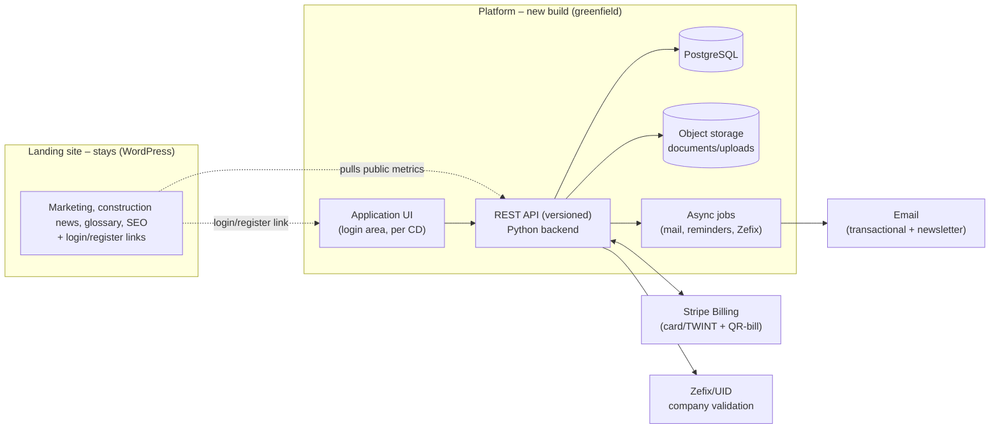

# Requirements Specification (Pflichtenheft) – Backend Relaunch sub360.ch

| | |
|---|---|
| **Project** | Relaunch of the sub360.ch application backend |
| **Client** | Ahmed Azizou / x21 AG |
| **Document type** | Requirements specification (functional & non-functional) |
| **Status** | Draft v0.1 for review |
| **Date** | 25 May 2026 |
| **Supersedes** | Specification 2021 (Banovi AG) – backend part only |

> **Priorities:** MUST = mandatory for Phase 1 go-live, SHOULD = important, ideally Phase 1, COULD = optional / Phase 1 if effort allows. Phase 2 features are listed separately in Section 12 and are **not** part of this relaunch scope.

---

## 1. Background & Management Summary

sub360.ch is a B2B platform for the Swiss construction industry connecting **clients** (general/total contractors, construction companies, SMEs) with **subcontractors** (service providers/sub-tradespeople). Clients post jobs and search for verified subcontractors; subcontractors maintain a company dossier, view tenders and apply.

The existing backend was poorly engineered: unfixable bugs, lack of scalability and security weaknesses. It will be **completely rebuilt** (greenfield) on **Python + PostgreSQL**. The previous code base will not be carried over; the **data set (~280 companies)** will be migrated.

**Scope ("backend only"):** Here, "frontend" refers solely to the public WordPress **landing/marketing site** (incl. construction news/glossary) – it remains unchanged. "Backend" refers to the entire **application platform behind the login**, which is rebuilt from scratch: server (Python/PostgreSQL), API and the associated **application UI** (login area) per the existing corporate design. Landing site and platform are **fully decoupled**; the only touch points are (a) login/register links from the landing site to the platform and (b) a few public metrics (e.g. company count) that the landing site pulls from the platform.

---

## 2. Goals and Non-Goals

**Goals (Phase 1)**
- Secure, maintainable and scalable backend (eliminating the legacy issues).
- Functional parity with today's scope, plus automated document checks and a clean subscription/payment process.
- Clear, documented API as a stable basis for the application UI and Phase 2 extensions.
- Lossless migration of the existing data (~280 companies incl. related data).
- Compliance with relevant regulations (Swiss FADP/revDSG, GDPR if applicable).

**Non-Goals (Phase 1 – see Section 12)**
- SIA 451 / CBRX / NPK import, online bills of quantities.
- Sub-projects and position-level quote comparison.
- Automatic matching between job and subcontractor.
- "Staffing provider" role (fully excluded).
- Frontend redesign / new screen design.

---

## 3. System Context & Scope

**Open point #1:** The application UI of the login area is part of the build scope (implemented per the existing corporate design). The UI technology – server-rendered or JS SPA against the API – is to be finalized with the agency at kickoff. The landing↔platform coupling is limited to links and a public metrics endpoint (small, to be specified early).

---

## 4. Roles & Permissions

| Role | Access | Key rights |
|---|---|---|
| **Public** | not logged in | View company info, fuzzy subcontractor search, start registration |
| **Client** | login | Detailed subcontractor search, post/manage jobs, view applications, manage own account/team |
| **Subcontractor** | login (subscription) | Maintain company dossier, upload documents, view tenders, apply/quote, manage subscription |
| **Admin/Back office** | internal login | Verification & approval, user/content management, banners, newsletter, reporting, audit |

Permissions are role-based (RBAC). Multiple users per company must be possible (team); clients up to 2 users free of charge (see FA-1100 ff.).

---

## 5. Functional Requirements

### 5.1 Registration & Onboarding
| ID | Requirement | Prio |
|---|---|---|
| FA-0101 | Separate registration flows for client and subcontractor (`register/ag`, `register/sub`). | MUST |
| FA-0102 | Email verification (double opt-in) before activation. | MUST |
| FA-0103 | Subcontractor goes through a multi-step onboarding: master data → trades → document upload → package selection → payment. | MUST |
| FA-0104 | Client onboarding without payment; capture of company master data and contact person. | MUST |
| FA-0105 | Robust handling of already-registered addresses (no abort of the process – legacy bug). | MUST |
| FA-0106 | Save and resume an incomplete onboarding. | SHOULD |

### 5.2 Authentication, Account & Permissions
| ID | Requirement | Prio |
|---|---|---|
| FA-0201 | Login with email/password, strong password policy, password reset. | MUST |
| FA-0202 | Role-based permissions (client/subcontractor/admin). | MUST |
| FA-0203 | Multiple users per company (team management, invitations). | MUST |
| FA-0204 | Session/token management with expiry and "log out all sessions". | MUST |
| FA-0205 | Two-factor authentication (at least for admin). | SHOULD |

### 5.3 Company Dossier (Subcontractor)
| ID | Requirement | Prio |
|---|---|---|
| FA-0301 | Maintain a structured company dossier (master data, description, references, trades, service regions, capacity). | MUST |
| FA-0302 | Multi-select of trades per the trade catalogue (4 clusters, see Appendix A). | MUST |
| FA-0303 | Subcontractor can control whether the profile is publicly visible (opt-in/opt-out). | SHOULD |
| FA-0304 | Completeness/quality indicator for the profile. | COULD |

### 5.4 Document Management & Automated Checks
| ID | Requirement | Prio |
|---|---|---|
| FA-0401 | Upload of proof documents (PDF/image); **insurance proof is mandatory**. | MUST |
| FA-0402 | Secure upload: size/type validation, malware scan, storage in object storage (non-public, signed URLs). | MUST |
| FA-0403 | Capture of validity/expiry dates of proofs (Phase 1 manual by subcontractor/back office); status assignment (valid/expired/review). Automated OCR extraction → **Phase 2**. | MUST |
| FA-0404 | Automatic company validation via UID/Zefix (company existence/status). | SHOULD |
| FA-0405 | Expiry monitoring with automatic reminders to the subcontractor and escalation to back office; expired mandatory proofs set the profile to "restricted". | MUST |
| FA-0406 | Versioning/history of uploaded documents. | SHOULD |

### 5.5 Verification & Approval Workflow (Back Office)
| ID | Requirement | Prio |
|---|---|---|
| FA-0501 | Review queue for submitted subcontractor profiles with status (open/in review/approved/rejected). | MUST |
| FA-0502 | Manual approval/rejection with reason; automatic pre-check flags suspicious cases. | MUST |
| FA-0503 | Activation only after payment received and successful review. | MUST |
| FA-0504 | Notify the subcontractor about approval/rejection. | MUST |
| FA-0505 | Complete audit log of all review/approval actions. | MUST |

### 5.6 Job/Project Tendering (Client)
| ID | Requirement | Prio |
|---|---|---|
| FA-0601 | Create/edit/close tenders with: trade, type (new build/conversion/renovation), location, file upload, optional material, optional project volume. | MUST |
| FA-0602 | Status lifecycle (draft/published/closed/awarded). | MUST |
| FA-0603 | Selectable tender procedure: public vs. by invitation of selected companies. | SHOULD |
| FA-0604 | Application deadline/dates; automatic closing after deadline. | SHOULD |
| FA-0605 | Overview of received applications per tender. | MUST |

### 5.7 Application / Quote (Subcontractor)
| ID | Requirement | Prio |
|---|---|---|
| FA-0701 | Apply to a tender "in one click", incl. attachment/quote. | MUST |
| FA-0702 | Written notification to the subcontractor about relevant/new jobs (criteria-based, simple rules in Phase 1). | SHOULD |
| FA-0703 | Client can accept/reject an application; status visible to the subcontractor. | MUST |
| FA-0704 | Client can mark favourite subcontractors. | COULD |

### 5.8 Search & Filter
| ID | Requirement | Prio |
|---|---|---|
| FA-0801 | Public search returns **fuzzy**, non-actionable results (registration incentive). | MUST |
| FA-0802 | Client search in the closed area: detailed results with filters (trade, region, availability, verified status). | MUST |
| FA-0803 | Full-text search over company dossiers (PostgreSQL full-text in Phase 1). | SHOULD |

### 5.9 Notifications (Transactional)
| ID | Requirement | Prio |
|---|---|---|
| FA-0901 | Transactional emails (registration, approval, application, payment, expiry warnings). | MUST |
| FA-0902 | Multilingual templates (DE/FR/IT/EN) based on user language. | MUST |
| FA-0903 | In-app notifications. | SHOULD |

### 5.10 Mass Email / Newsletter
| ID | Requirement | Prio |
|---|---|---|
| FA-1001 | Sending newsletters to segmentable recipient lists (trade, role, region). | SHOULD |
| FA-1002 | Subscribe/unsubscribe (opt-in/opt-out), bounce/unsubscribe management. | MUST |
| FA-1003 | Recommended: integration of an established mail service (e.g. Mailchimp/Brevo) instead of in-house build; via API. | SHOULD |

### 5.11 Payments & Subscriptions
| ID | Requirement | Prio |
|---|---|---|
| FA-1101 | Subcontractor subscriptions are paid; clients free (up to 2 users free – model to be confirmed in Appendix B). | MUST |
| FA-1102 | **Stripe Billing** integration: card + TWINT (one-off), recurring renewal via card/direct debit. | MUST |
| FA-1103 | Option **annual subscription via QR-bill** (Swiss B2B preference); semi-automatic reconciliation of incoming payment. | MUST |
| FA-1104 | Subscription management: upgrade/downgrade, cancellation, renewal, dunning on failed payment. | MUST |
| FA-1105 | Invoice/receipt generation, VAT-compliant; receipt download. | MUST |
| FA-1106 | No storage of card/bank data in the system (minimize PCI scope – tokenization at the provider). | MUST |

### 5.12 Advertising Banners
| ID | Requirement | Prio |
|---|---|---|
| FA-1201 | Manageable ad slots/banners (premium partners) with runtime and target region/trade. | COULD |

### 5.13 Multilingualism
| ID | Requirement | Prio |
|---|---|---|
| FA-1301 | System/UI texts and templates in DE/FR/IT/EN. | MUST |
| FA-1302 | User-generated content (tenders, company description) is **not** translated. | MUST |

### 5.14 Admin / Back Office & Reporting
| ID | Requirement | Prio |
|---|---|---|
| FA-1401 | Management of users, companies, tenders, content, banners. | MUST |
| FA-1402 | KPI dashboard (new registrations, active subscriptions, tenders, applications, open reviews). | SHOULD |
| FA-1403 | Export (CSV) of core data. | SHOULD |

### 5.15 Construction News Interface (WordPress)
| ID | Requirement | Prio |
|---|---|---|
| FA-1501 | News stays in WordPress; backend consumes/shows news on demand via feed/REST. No CMS rebuild. | COULD |

---

## 6. Non-Functional Requirements

| ID | Area | Requirement |
|---|---|---|
| NFA-01 | **Security** | OWASP Top 10 compliant; encrypted transport (TLS) and storage; secure authentication; protection against injection/CSRF/XSS; rate limiting; secure file uploads incl. malware scan; secrets management; dependency scanning. |
| NFA-02 | **Data protection** | Compliance with Swiss FADP/revDSG; GDPR where EU data subjects are concerned; data processing agreements (DPA) with all sub-processors; data subject access/erasure/export feasible. |
| NFA-03 | **Data residency** | Personal/document data preferably in CH/EU; hosting/storage location to be contractually secured (server decision open). |
| NFA-04 | **Scalability** | Horizontally scalable architecture (stateless API, external sessions/jobs); designed for significant growth beyond 280 companies. |
| NFA-06 | **Availability** | Target ≥ 99.5% in production; planned maintenance windows communicated. |
| NFA-08 | **Observability** | Structured logging, monitoring, alerting, central error tracking. |
| NFA-09 | **Backup/DR** | Regular, tested backups; defined RPO/RTO. |
| NFA-10 | **Audit** | Tamper-evident audit log for security/review-relevant actions. |
| NFA-11 | **Accessibility/Browsers** | Backend delivers clean data; frontend A11y remains with the landing site. |

---

## 7. Data Migration

- **Scope:** ~280 companies incl. associated users/logins, company dossiers, uploaded documents (files + metadata), active tenders and applications, subscription/payment status. **(Exact scope to be confirmed – open point.)**
- **Approach:** analyze legacy schema → map to target schema → ETL scripts → data cleansing → trial migration in staging → validation → final migration at cutover.
- **Passwords:** if hashing schemes are incompatible, forced password reset on first login instead of plaintext migration.
- **Documents:** transfer into the new object storage incl. validity status.
- **Acceptance:** sample reconciliation (completeness/correctness) as migration acceptance criterion.

---

## 8. External Interfaces

| System | Purpose | Note |
|---|---|---|
| Stripe Billing | subscriptions, payments, dunning, receipts | card/TWINT/QR-bill; Swiss alternatives Wallee/Payrexx/Datatrans |
| Email service | transactional + newsletter | recommendation: established provider via API |
| Zefix/UID | company validation | for FA-0404 |

---

## 9. Compliance & Legal

- **Swiss FADP/revDSG** mandatory; **GDPR** additionally if EU data subjects are addressed (to be clarified).
- Data processing agreements (DPA) with hosting, payment and mail providers.
- **Terms & conditions, privacy policy, imprint** on the website (existing/to be updated – incl. correct company form GmbH/AG, address, phone).
- Define retention and deletion periods for personal and business data.
- Embed industry-specific requirements (e.g. subcontractor proof obligations) in the review process.

---

## 10. Acceptance Criteria (Phase 1)

1. All MUST requirements implemented and confirmed in UAT.
2. Application UI works fully against the new API.
3. Migration of the ~280 companies is lossless (sample acceptance passed).
4. Security test (pen test) passed with no open critical/high findings.
5. Payment/subscription flow incl. renewal and dunning tested in production.
6. Monitoring, backup and logging active in production.

---

## 11. Assumptions & Open Points

| # | Point | Status |
|---|---|---|
| 1 | Application UI part of the build; UI technology (server-rendered vs. SPA) | to confirm/decide |
| 2 | Hosting/server and storage location (CH residency?) | open (later) |
| 3 | Exact subscription tiers/prices + client free-tier model | open → Appendix B |
| 4 | GDPR relevance (EU data subjects) | open |
| 5 | Newsletter tool (in-house vs. provider) | recommendation: provider |
| 6 | Exact migration scope (master data only vs. incl. active data) | open |
| 7 | OCR automation of proofs | → deferred to Phase 2 |

---

## 12. Outlook Phase 2 (not in relaunch scope)

- Online bills of quantities per NPK; import **SIA 451 / CBRX**.
- Projects with **sub-projects** (quantities, units, dates).
- **Position-level quote comparison**, logged bid opening, automatic reminders/rejections.
- **Automatic matching** job ↔ subcontractor (possibly a dedicated search engine).
- **OCR-based check** of proof documents (automatic extraction of validity/expiry dates, plausibility rules).

---

### Appendix A – Trade Catalogue (4 clusters)
Main construction trades · Secondary/finishing trades · Technology & industry · Planning & construction (detailed positions per the current website).

### Appendix B – Subscription/Pricing Model (to be completed)
Subcontractor packages (tiers, term, price), client free-tier limit (2 users), payment methods per tier.
